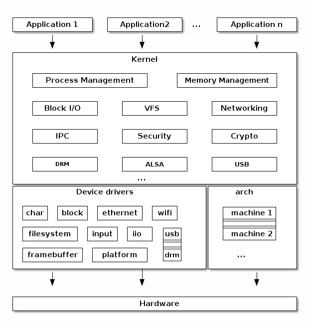

# Fundamentals

## What is an Operatig System

An Operating System(OS) is a system software that acts as an intermediary between users/applications and the computer hardware, managing CPU, memory, devices, and network resources.

## Core components of a Linux based Operating Systems


### Hardware: The Physical Foundation

- It contains physical entity of the system,controlled indirectly through the kernel.
- CPU (Central Processing Unit): The "brain" of the computer that performs calculations and executes instructions.
- RAM (Random Access Memory): Temporary memory. Used for temporary storage of data that the CPU needs to access quickly.
- Storage (Disk): Hard drives (HDD) or solid-state drives (SSD) where the operating system, applications, and your files are stored.
- Network Interfaces: Components that allow the computer to connect to a network.
- Peripherals: Devices like keyboards, mice, monitors, and printers.

### Linux Kernel: The Core of the Operating System

- Core component of the linux operating system.
- Manages processes, memory, file systems, devices, and networking.
- Implements system calls to allow user-space programs to request services.

### System Libraries: The Interface to the Kernel

- Provide precompiled code and APIs for applications to use system services.
- Includes standard libraries for I/O, networking, and cryptography.

### System Utilities: Core OS Tools

- Core tools provided by the OS to manage files, processes, and services.
- Enable system administration, monitoring, and configuration

### Shell: The Command-Line Interface

- Command-line interface for interacting with the OS.
- Acts as a bridge between the user and system utilities.
- Supports scripting, pipelines, and automation of tasks.

### User Applications: The Software You Use

- Run in user space, isolated from the kernel for security and stability.
- Include text editors, databases, web servers, and container runtimes.
- Interact with the system via system calls and libraries.


Analogy: Diagram shows how the whole company is structured from customer to factory.


## Linux Kernel Architecture



- Process Management: 
  - It is responsible for creating, scheduling, and terminating processes.
  - The scheduler determines which process gets to use the CPU at any given time, ensuring fair and efficient CPU utilization.
- Memory Management: 
  - It manages the system's memory.
  - It handles the allocation and deallocation of memory to processes, implements virtual memory to give each process its own address space, and manages swapping between RAM and disk.
- Virtual File System (VFS): 
  - The VFS provides a unified interface to various file systems.
  - This abstraction allows user applications to interact with different types of file systems (e.g., ext4, NTFS, NFS) in a consistent manner.
- Networking: 
  - The kernel's networking stack is responsible for handling network communication.
  - It manages network protocols (like TCP/IP), network devices, and the routing of network packets.
- Device Drivers:
  - It facilitate communication between the kernel and the system's hardware devices.
  - They abstract the specifics of the hardware, presenting a common interface to the rest of the kernel.
- Inter-Process Communication (IPC): 
  - It provides mechanisms for processes to communicate with each other.
  - This includes features like signals, pipes, and sockets.

Analogy: Diagram shows how the factory managers and machines are organized internally.


## Package Manager

Package manager is a tool that automates the process of installing, updating, configuring, and removing software packages. You can think like its an app store but command line driven. Package manager ensures,
- All dependencies are installed.
- Files go to correct system path.
- Version control and verification(signatures, checksums) are handled correctly.

### What is a "Package"?

Package is a bundle of files that makes the software application, plus metadata. Each package typically contains:

- Executable files(Binaries)
- Configuration files
- Documentation / man pages
- Dependency information
- Metadata (name, version, maintainer, description)
- Signatures (for authenticity)

## Types of package managers

| Linux Family               | Package Manager               | Package Format | Example Commands       |
| -------------------------- | ----------------------------- | -------------- | ---------------------- |
| **Debian / Ubuntu**        | `APT` (Advanced Package Tool) | `.deb`         | `apt install nginx`    |
| **RHEL / CentOS / Fedora** | `YUM` (older), `DNF` (modern) | `.rpm`         | `dnf install nginx`    |
| **SUSE / openSUSE**        | `Zypper`                      | `.rpm`         | `zypper install nginx` |
| **Arch Linux**             | `pacman`                      | `.pkg.tar.zst` | `pacman -S nginx`      |
| **Alpine Linux**           | `apk`                         | `.apk`         | `apk add nginx`        |
| **Gentoo**                 | `Portage`                     | Source-based   | `emerge nginx`         |

## 🧭 Life Cycle of Installing a Package

Let’s take apt install nginx as an example.

Step-by-step breakdown:

1. User command:
    
    `sudo apt install nginx`

2. APT checks the package list

    - It looks up the package in `/etc/apt/sources.list` or `/etc/apt/sources.list.d/.`
    - Finds which repository contains `nginx`.

3. ependency resolution

    - APT checks all required libraries.
    - Ensures no version conflicts.
    - Prepares a dependency tree.

4. Package download

    - Downloads `.deb` files from the mirror server.
    - Stored temporarily in `/var/cache/apt/archives/`.

5. Verification

    - Checks GPG signatures against trusted keys in `/etc/apt/trusted.gpg.d/`.

6. Installation

    - Extracts the `.deb` file (using `dpkg` under the hood).
    - Copies files to correct directories (`/usr/bin`, `/etc/nginx/`, etc.).
    - Registers the package in `/var/lib/dpkg/status`.

7. Post-install scripts

    - Executes pre/post install scripts (`preinst`, `postinst`) defined in the package.

8. Cleanup

    - Updates package database.
    - Keeps cache for reinstallation or rollback.

## 🧩 Core Components of a Package Management System


### 1. 📦 Package Format
- A compressed file containing the software, its metadata, and installation scripts.
- Common formats:
  - `.deb` → Debian/Ubuntu (used by `dpkg`/`apt`)
  - `.rpm` → RedHat/CentOS/Fedora (used by `yum`/`dnf`)
  - `.pkg.tar.zst` → Arch Linux (used by `pacman`)
- Contains:
  - Binaries and executables
  - Configuration files
  - Dependency list
  - Post-install/pre-remove scripts


### 2. 🗂️ Package Database
- Stores information about installed packages and their versions.
- Maintains details like:
  - Installed file paths
  - Dependency relationships
  - Installation timestamps
- Example locations:
  - `/var/lib/dpkg/` → Debian-based
  - `/var/lib/rpm/` → RedHat-based


### 3. 🌐 Repositories (Package Sources)
- Centralized servers or mirrors that host collections of verified packages.
- Each repository contains:
  - Software binaries
  - Metadata (dependencies, maintainers, versions)
  - Signatures for integrity
- Configured in files like:
  - `/etc/apt/sources.list`
  - `/etc/yum.repos.d/*.repo`
- Types of repositories:
  - Official (maintained by distro)
  - Third-party (e.g., Docker, VS Code)
  - Local (internal organization repos)


### 4. 🧠 Dependency Resolver
- Determines which additional packages are required for installation.
- Handles:
  - **Dependencies** (packages required)
  - **Conflicts** (packages that can’t coexist)
- Ensures a consistent and working system.


### 5. ⚙️ Package Manager (Frontend Tool)
- The user-facing CLI or GUI used to install, remove, and update packages.
- Interacts with repositories, dependency resolver, and backend installer.
- Examples:
  - `apt`, `dnf`, `yum`, `pacman`, `zypper`
- Responsibilities:
  - Fetching packages
  - Verifying integrity
  - Running post-install scripts


### 6. 🔐 Security & Verification System
- Ensures packages are authentic and untampered.
- Mechanisms:
  - GPG signature verification
  - Checksums (e.g., SHA256)
- Protects against:
  - Corrupted downloads
  - Malicious modifications


### 7. 🧰 Low-Level Backend Tool
- The core engine that installs or removes files from the system.
- Works under the frontend manager.
- Examples:
  - `dpkg` → used by `apt`
  - `rpm` → used by `yum` and `dnf`
  - `pacman` → both frontend and backend
- Tasks:
  - File placement
  - Database updates
  - Running pre/post scripts


### 8. 🔁 Update & Upgrade Mechanism
- Keeps the system and software up to date.
- Fetches new package lists, compares versions, and applies upgrades.
- Examples:
  - `apt update && apt upgrade`
  - `dnf update`
- Ensures latest features, stability, and security patches.


### 🧭 Example Workflow (APT)
```
User → apt install nginx
        ↓
Dependency Resolver → Checks dependencies
        ↓
Repository → Fetches nginx + dependencies
        ↓
dpkg Backend → Installs and configures
        ↓
Verification → GPG & checksum validation
        ↓
Database → Updates installed package records
```