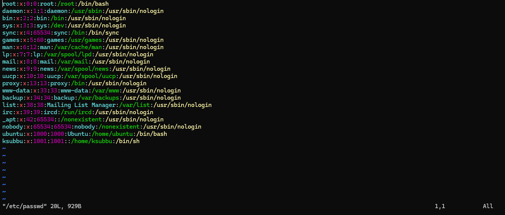
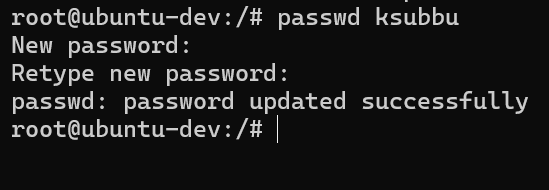
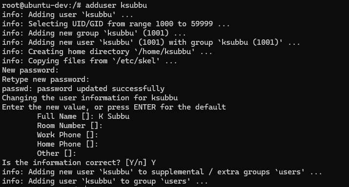
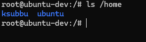
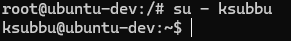

# User Management

- Linux is a multi-user operating system, meaning multiple users can operate on a system simultaneously.
- User management in linux involves creating, modifying, and deleting user accounts and groups to control access to system resources.
- Proper user management ensures security, controlled access, separation of user data and privileges.

## Creating a user:

### Without a Home Directory

```
# useradd username
```

- Creates a user entry in the system but does not create a home directory (`/home/username`).
- Used mostly in scripts or automation.

## Check Created User:

```
# vim /etc/passwd
```

- The `/etc/passwd` file contains details about all system users.
- Each line represents one user entry.



## Add Password for the User

```
# passwd username
```
- Sets or updates the user’s password.
- Stores user passwords in encrypted (hashed) form.



## Check Encrypted Password

```
# cat /etc/shadow
```
- You can see the encrypted password.
- Even root users cannot decrypt or restore the original password — they can only reset it.

## Delete a User

```
# userdel username
```

- Removes the user account.
- Does not delete the home directory.

## Create a User with Home Directory

```
# adduser username
```

- Creates a user and automatically sets up:
    - /home/username
    - User password
    - Default shell
- Recommended for manual user creation.



## Verify User's Home Directory

```
# ls /home
```



## Switch to a New User

```
# su - username
```

- Switches to another user account.
- The - (hyphen) loads that user’s full environment and home directory.




## Difference between `useradd` vs `adduser`?

- `useradd` 
    - It is used when you are writing the shell script. 
    - It doesn't take any  information and it doesn't create any `/home/user`.
- `adduser` 
    - It is used when you create a user manually.
    - It takes lot of info about user and also creates `/home/user.`


# Group Management

- Groups are used to manage permissions for multiple users at once.
- Each user has one primary group and can be part of multiple secondary groups.

## Creating a Group

```
# groupadd groupname
```

- Creates a new group.

## Check Existing Group

```
# cat /etc/group
```

- Checks and Lists all groups and their member users.

### Delete a group

```
# groupdel groupname
```

### Add a User to a Group

```
# usermod -aG groupname username
```

- a stands for "append." This adds the new group to the user's list.
- G specifies the "secondary group."

> Warning: If you forget the -a flag (e.g., usermod -G ...), you will remove the user from all other secondary groups and add them only to this one.

### List all Groups for a User

```
# groups username
```

- Lists the groups that a specific user is part of

## SSH (Secure Shell)

- It is an highly secure tunnel for accessing and managing a machine over an unsecured network(internet).
- It allow you to login to another machine, interact with it, and execute commands remotely, as if you were sitting infront of it.
- It encrypts all communication between your local machine and remote machine.
- This prevents eavesdropping, connection hijacking, and other attacks.
- When you use the `ssh` command on your laptop, you are using the SSH client.

## SSHD (Secure Shell Daemon)

- It is a sever side of SSH.
- It is an background service that runs constantly on the remote machine.
- It listens to incoming SSH connection request over a specific network port.
    - When request comes in, it authenticates using password or cryptographic keys and then starts a shell session for them.

## How do you login to Linux OS created in Cloud provider (AWS)?

### On the AWS side

- You launch an EC2 instance (a vertual server), i.e., a Linux Server.
- This linux server comes with pre installed `sshd` and is configured to start automatically when the system boots.
- During instance creation, you generate an SSH key-pair
    - Private key: (.pem or .ppk) → kept securely on your local machine.
    - Public key: Automatically stored in the server under the user's `~/.ssh/authorized_keys` file.
    - The public IP address of the instance.

### On the Local machine side

- You have the private .pem key
- You use the SSH client to securly login to your EC2 linux server
- `ssh -i mykey.pem ec2-user@<YOUR_EC2_PUBLIC_IP>`


## The connection process

- You run the SSH command on your local system.
- The `SSH` client sends a connection request to the instance's public IP on port 22.
- The `SSHD` daemon on the server receives the request.
- `SSHD` checks your public key in `~/.ssh/authorized_keys`.
- If it matches your private key, authentication succeeds.
- `SSHD` opens an interactive shell session → you now control the remote Linux OS.